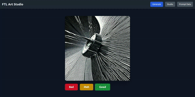
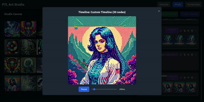
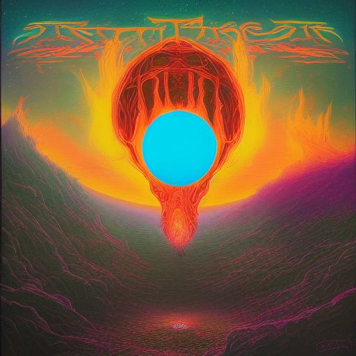

# FireLighT - FTL Art Studio

<p align="center">
  
  &nbsp;
  
</p>

FireLighT (FLT) is a creative project designed to explore the generation and manipulation of AI-generated imagery. What started as a fun endeavor to find a name for our band (which we knew had to have the acronym FTL and involve sci-fi themes) has evolved into a powerful tool for generating random images around a theme, rating them for future training, and creating captivating animations by interpolating between them with fine-grained control over transitions.

## Features

*   **Random Image Generation:** Generate unique images based on dynamically constructed prompts.
*   **Image Curation:** Rate generated images as "good," "meh," or "bad" to curate a dataset for potential future training or selection.
*   **Latent Space Interpolation:** Create smooth, animated transitions between any two generated images.
*   **Timeline Management:** Organize and manage sequences of interpolated images as "timelines" for easy viewing and further manipulation.
*   **Prompt Data Management:** Customize the vocabulary used for random prompt generation.
*   **Web-based UI:** An intuitive interface for interacting with the Art Studio.

## How it Works

### Random Prompt Generation

To ensure maximum variability without relying on a large language model (LLM) for prompt generation (though this could be a future enhancement), FireLighT constructs prompts by randomly selecting elements from predefined lists. These lists include:

*   **Names:** A list of nouns or concepts.
*   **Art Styles:** Descriptive adjectives or artistic movements.
*   **Mediums:** Different art forms (e.g., "photograph," "watercolor," "drawing").

A typical prompt is formed by combining a medium with four random styles, followed by a randomly chosen name, e.g., `"{medium} {style1} {style2} {style3} {style4} piece called {name}"`. This simple yet effective method allows for a vast array of unique prompt combinations, leading to diverse image outputs. You can manage these lists via the "Prompt Data" section in the UI.

### The Challenge of Interpolation

One of the core functionalities of FireLighT is the ability to interpolate between images in the latent space, creating smooth visual transitions. This presents a significant technical challenge, particularly when working with diffusion models from the Hugging Face `diffusers` library.

Unlike some other generative models, diffusion pipelines like Stable Diffusion do not provide a natural, direct way to interpolate between the internal representations (latents and prompt embeddings) that drive image generation. These critical components are typically computed internally by the pipeline and are not easily exposed or re-injected.

To overcome this, we had to implement a custom solution:

1.  **Manual Interpolation:** We manually interpolate between the different embedding types:
    *   **Latent Vectors:** Spherical Linear Interpolation (SLERP) is used for latent vectors to ensure a smooth, perceptually uniform transition in the high-dimensional latent space.
    *   **Prompt Embeddings:** Linear interpolation is applied to the prompt embeddings, which represent the textual guidance for the image generation.
2.  **Custom Pipeline Subclassing:** We subclassed the `StableDiffusionPipeline` (creating `InterpPipeline` in `utils.py`) and modified deep parts of its `__call__` method. This allowed us to:
    *   Pass in pre-computed and interpolated latent vectors (`latents` parameter).
    *   Pass in pre-computed and interpolated prompt embeddings (`prompt_embeds` parameter).

This intricate modification enables FireLighT to precisely control the image generation process at each step of the interpolation, resulting in seamless animations that blend one image into another.

## Getting Started

### Requirements

*   Python 3.x
*   `pip` (Python package installer)
*   `git` (for cloning the repository)

### Setup

1.  **Clone the repository:**

    ```bash
    git clone https://github.com/TTrapper/FireLighT.git
    cd FireLighT
    ```

2.  **Create a virtual environment (recommended):**

    ```bash
    python3 -m venv env
    source env/bin/activate  # On Windows, use `env\Scripts\activate`
    ```

3.  **Install dependencies:**

    ```bash
    pip install -r requirements.txt
    ```

### Usage

1.  **Start the Art Engine Server:**
    Navigate to the project root directory and run:

    ```bash
    python art_engine_server.py
    ```
    This will start the Flask server, which handles image generation, data storage, and API endpoints. The server will typically run on `http://172.0.0.1:5001`.

2.  **Access the Web UI:**
    Open your web browser and go to `http://172.0.0.1:5001`.

### Web UI Sections

The web interface is divided into several sections:

*   **Generate:**
    *   Allows you to generate new random images.
    *   You can rate the generated images ("Good," "Meh," "Bad") to curate your collection. Unrated images will appear here for review.
*   **Studio:**
    *   Displays all "Good" rated images.
    *   **Select Images:** Click on images to select them. You can select two images for interpolation or multiple images to create a custom timeline.
    *   **Interpolate (2):** Select two images and click this button to generate a sequence of interpolated images between them. A new timeline will be created.
    *   **Link Selected (2):** Select two images and click this button to create a new timeline with just these two images, establishing a direct link.
    *   **Create Timeline:** Select multiple images and click this button to create a new timeline containing all selected images in the order they were selected.
    *   **Timelines Panel:** On the right, you can view and manage existing timelines.
        *   **Interpolate (in-place):** Within a timeline, select two *consecutive* images and click the "Interpolate (2)" button next to the timeline name to insert interpolated frames directly into that timeline.
        *   **Copy Timeline:** Duplicate an existing timeline.
        *   **Reverse Timeline:** Reverse the order of images in a timeline.
        *   **Delete Timeline:** Remove a timeline.
        *   **Open GIF View:** View a timeline as an animated GIF, with controls for speed and playback.
*   **Prompt Data:**
    *   Allows you to view and edit the lists of "Names," "Art Styles," and "Mediums" used for random prompt generation.
    *   Make changes in the text areas and click "Save All Changes" to update the server's prompt vocabulary.

## Project Structure

*   `art_engine_server.py`: The main Flask application, handling API endpoints, image generation, and data management.
*   `utils.py`: Contains utility functions for interpolation (SLERP, linear) and the custom `InterpPipeline` class for handling pre-computed latents and prompt embeddings.
*   `templates/art_engine_ui.html`: The frontend web interface for the Art Studio.
*   `config/prompt_data.json`: Stores the lists used for random prompt generation.
*   `data/`: Directory for storing generated images, latent tensors, prompt embeddings, nodes metadata, and timelines.
    *   `data/images/`: Stores the generated image files.
    *   `data/nodes/`: Stores metadata for each generated image (ArtNode).
    *   `data/tensors/`: Stores the latent and prompt embedding tensors.
    *   `data/timelines/`: Stores metadata for image sequences (timelines).
*   `bad_images/`, `good_images/`, `meh_images/`: Directories for manually moving rated images (not directly managed by the UI, but useful for manual curation).

## Contributing

We welcome contributions! Feel free to open issues for bugs or feature requests, or submit pull requests.

## License

This project is licensed under the MIT License - see the [LICENSE](LICENSE) file for details.


